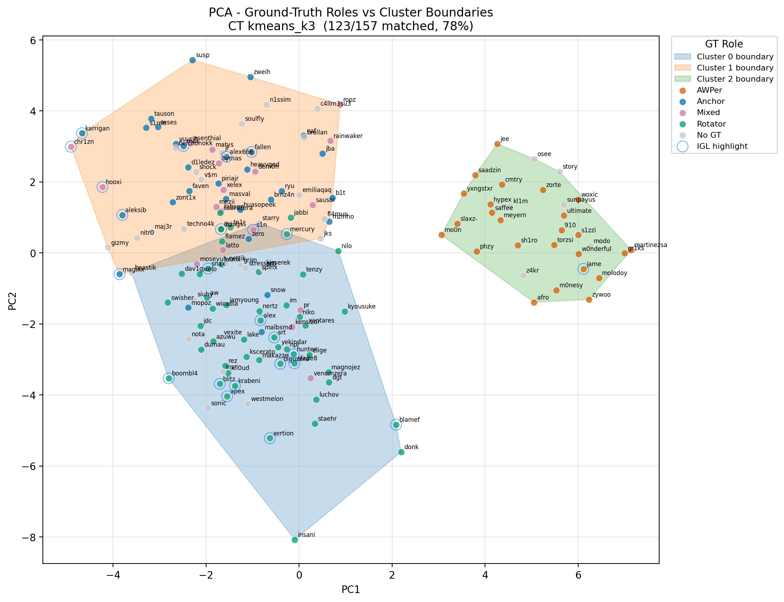
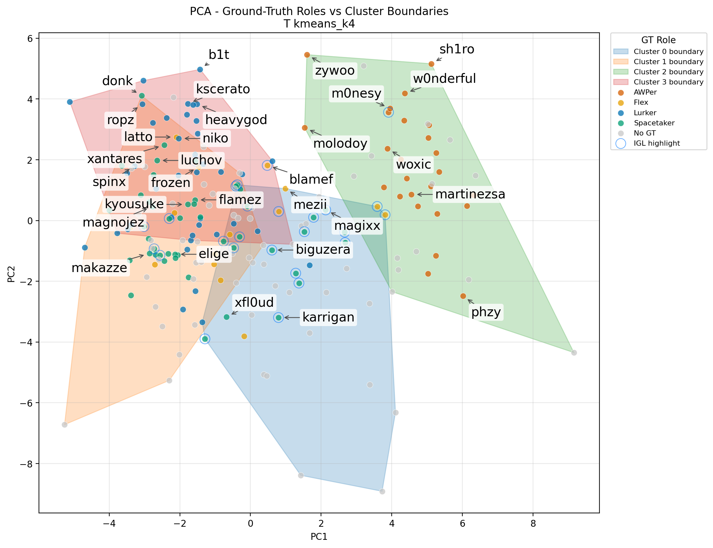
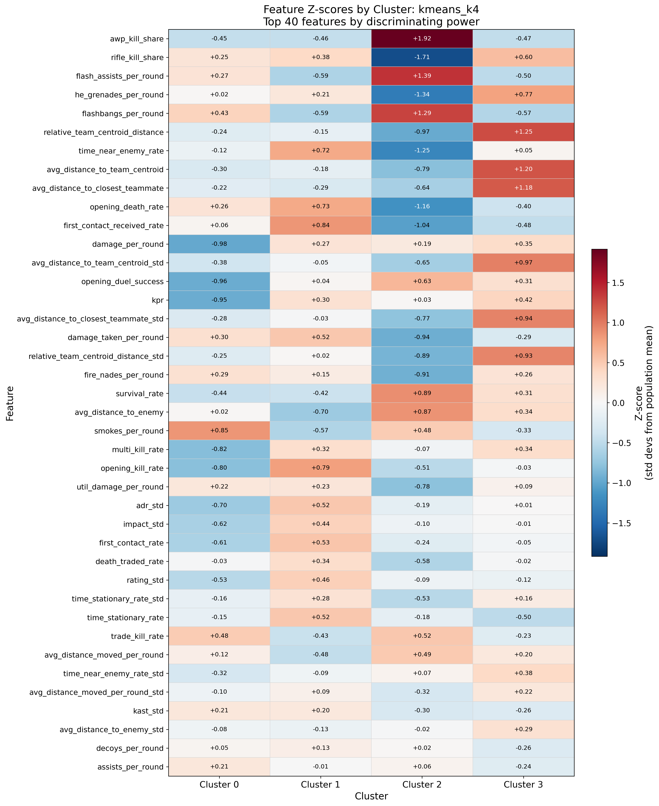
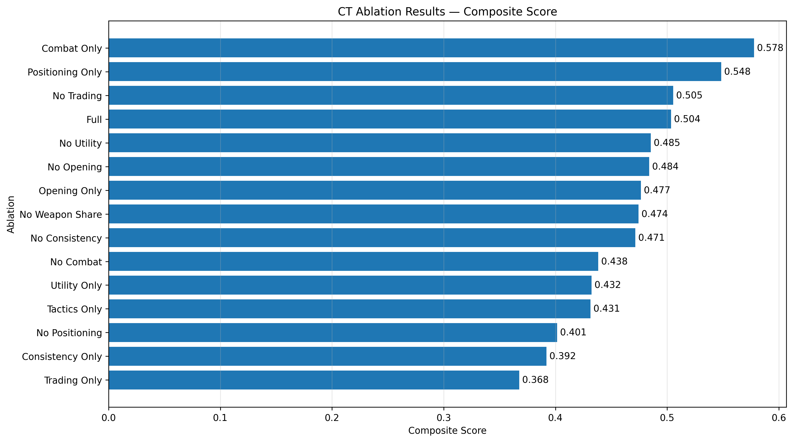
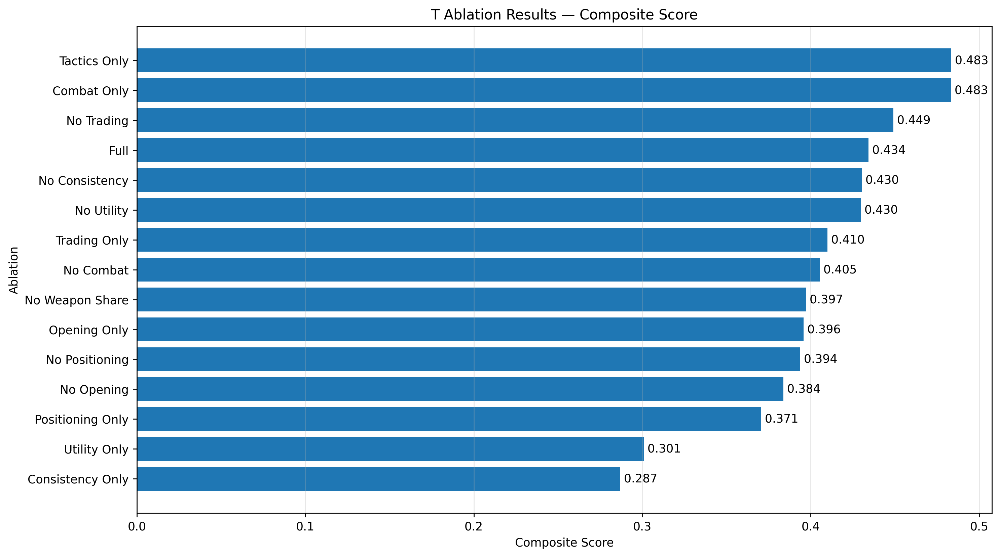

# Unsupervised Role Discovery from Professional Counter-Strike 2 Demo Data 
## Overview

This project builds an end-to-end unsupervised learning pipeline to discover professional Counter-Strike 2 player role archetypes from raw demo files. Using 463 successfully parsed professional demos and 214 players, the pipeline parses .dem replay data, engineers side-specific behavioral and positional features, and evaluates whether recognizable roles emerge naturally from gameplay behavior.

The project compares KMeans, Gaussian Mixture Models, and HDBSCAN using internal clustering metrics, subsampling stability analysis, expert-curated role annotations, feature-profile analysis, and feature ablations. The main finding is that AWPers are highly separable across both CT and T side, while rifler and IGL-related roles are more overlapping and context-dependent.

The full report can be read [here](Report.pdf)

Explore the results interactively in the live [Streamlit dashboard](https://cs2-role-clustering-3qq6f6jdtot762u6jjn979.streamlit.app/).

## Research Question

Can professional CS2 player roles be discovered from behavioral and positional gameplay statistics using unsupervised learning?

## Data and Pipeline

The dataset includes 463 successfully parsed professional demos from four S-tier events and covers 214 professional players. Each player is modeled separately on CT and T side because role behavior differs substantially between attacking and defending.

The pipeline extracts combat events, utility usage, opening duels, trade interactions, movement behavior, and player positioning. Count-based features are converted to per-round rates, positional measures are averaged over replay observations, and selected features include across-demo standard deviations to capture behavioral variability.

Feature groups include:

| Group         | Examples                                                                  |
| ------------- | ------------------------------------------------------------------------- |
| Combat        | Damage per round, kills per round, survival rate, rifle/AWP kill share    |
| Opening duels | Opening kill rate, opening death rate, first contact rate                 |
| Trading       | Trade kill rate, death traded rate, trade participation                   |
| Utility       | Smokes, flashes, incendiaries, flash assists, utility damage              |
| Positioning   | Distance to enemies, distance to team centroid, nearest teammate distance |
| Movement      | Movement distance per round, stationary rate                              |

## Modeling and Evaluation

All numeric features are standardized before clustering. The project evaluates KMeans, Gaussian Mixture Models, and HDBSCAN, with PCA used for visualization.

Because there is no definitive label set for CS2 roles for all players, model quality is evaluated using multiple signals:

| Method                    | Purpose                                                |
| ------------------------- | ------------------------------------------------------ |
| Silhouette score          | Measures cluster separation                            |
| Davies-Bouldin index      | Measures cluster compactness                           |
| Subsampling ARI stability | Tests whether clusters reappear under 80% subsampling  |
| Expert role annotations   | Measures alignment with curated role labels            |
| Feature ablations         | Tests which feature groups drive the cluster structure |

External validation uses expert-curated role annotations from [NER0cs's Positions Database](https://public.tableau.com/app/profile/harry.richards4213/viz/PositionsDatabaseNER0cs/PositionsDatabaseNER0cs), maintained by Harry "NER0cs" Richards, a Counter-Strike analyst and writer for HLTV.org. The database contains manually labeled roles for prominent professional players in top-tier Counter-Strike 2. These labels are treated as expert reference annotations rather than absolute ground truth.

## Key Results
#### CT Side

The best CT-side model is KMeans with k = 3.

| Cluster | Result                                      |
| -------------- | ------------------------------------------- |
| Rotators       | Cleanest non-AWPer CT rifler group          |
| Anchors        | Meaningful but noisier CT rifler group      |
| AWPers         | 100% purity against expert reference labels |

The CT model achieved a stability ARI of 0.992, a matched-sample purity of 78.9%, an external-label ARI of 0.612, and a composite score of 0.523. The main CT-side finding is that AWPers are highly separable, while riflers split into a distinct but imperfect Rotator/Anchor structure.

    

#### T Side

The best T-side model is KMeans with k = 4.

| Cluster type       | Result                                         |
| ------------------ | ------------------------------------------------------ |
| AWPers             | Cleanest and most stable T-side cluster                |
| Lurkers            | Strongest non-AWPer T-side cluster                     |
| Spacetakers        | Split into aggressive and utility-oriented subgroups    |
| IGL-enriched subgroup | Utility-oriented cluster with strong IGL concentration |

The T-side model achieved a stability ARI of 0.835, a matched-sample purity of 78.9%, an external-label ARI of 0.456, and a composite score of 0.427. AWPers were again the most separable role, while Lurkers formed the clearest non-AWPer group. Spacetakers were divided into an aggressive high-contact group and a lower-output, utility-oriented group enriched with IGLs.

    

    

The model also identified an IGL-enriched subgroup characterized by stronger utility usage and teammate-proximity patterns. Because the model has no access to voice communication or strategy calls, this cluster should be interpreted as an indirect behavioral signal rather than proof that in-game leadership is directly observable from the derived statistics alone.

    

## Ablation Analysis

The ablation experiments hold the number of clusters constant at k = 3 for CT and k = 4 for T. They include removal-based tests, where one feature group is excluded from the full model, and category-only tests, where clustering uses a single feature group. Results are compared using composite score, external-label ARI, matched-sample purity, subsampling stability, and silhouette score.

On the CT side, removing trading or utility features has little effect on external role agreement. Removing positioning and movement features causes the largest decline in external-label ARI, purity, and composite score, indicating that the Rotator/Anchor split depends heavily on spatial behavior. On the T side, no single feature category reproduces the complete interpretation. Combat and weapon variables create strong statistical separation, while positioning, contact, utility, and teamwork features contribute different parts of the role structure.

<table>
  <tr>
    <td width="50%">
      
    </td>
    <td width="50%">
      
    </td>
  </tr>
</table>

## Main Findings

- AWPers are the most separable role across both CT and T side.
- CT-side riflers split into a meaningful but imperfect Rotator/Anchor structure.
- T-side Lurkers are reasonably separable, while Spacetakers divide into overlapping aggressive and utility-oriented groups.
- The IGL-enriched T-side cluster suggests that some calling responsibilities may leave indirect signals through utility usage and teammate proximity.
- KMeans produced the most interpretable role structures. GMM was less stable, while HDBSCAN produced highly stable but overly broad two-cluster solutions.
- CT-side ablations show that the Rotator/Anchor split is most sensitive to positioning and movement features, while T-side role structure is distributed across several interacting feature groups.

## Limitations

The final clustering dataset covers 214 players, which is small for unsupervised learning and restricted to top-tier professionals, creating a compressed skill distribution where role differences may be subtle and/or overlapping.

The external role annotations are expert reference labels, not absolute ground truth. CS2 roles vary by map, side, opponent, economy state, roster context, and team system, and some players occupy multiple roles simultaneously.

The current feature set averages behavior across maps, which improves player-level stability but removes tactical context, especially on CT side where anchoring, rotation, and site responsibility are highly map-dependent.

The model also has no access to voice communication, mid-round calls, or set strategies, which is especially relevant for interpreting the IGL-enriched cluster as an indirect behavioral signal rather than direct proof of in-game leadership.

## Future Work

The highest-priority next step is map-stratified clustering, which could preserve positional role structure that is currently averaged across maps.

