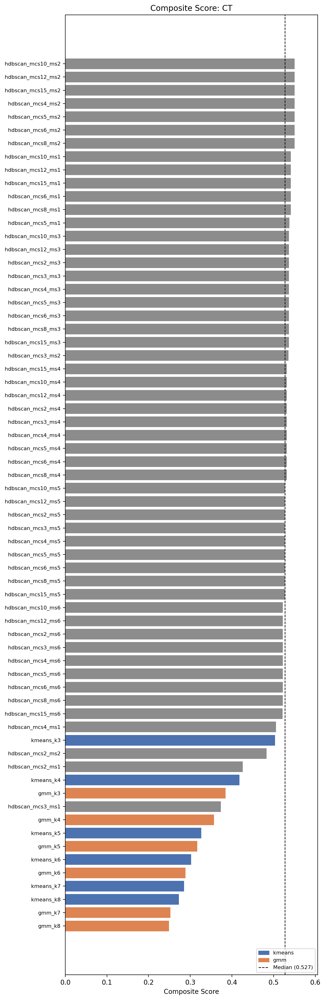
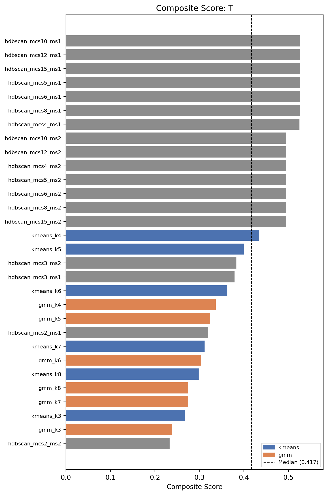
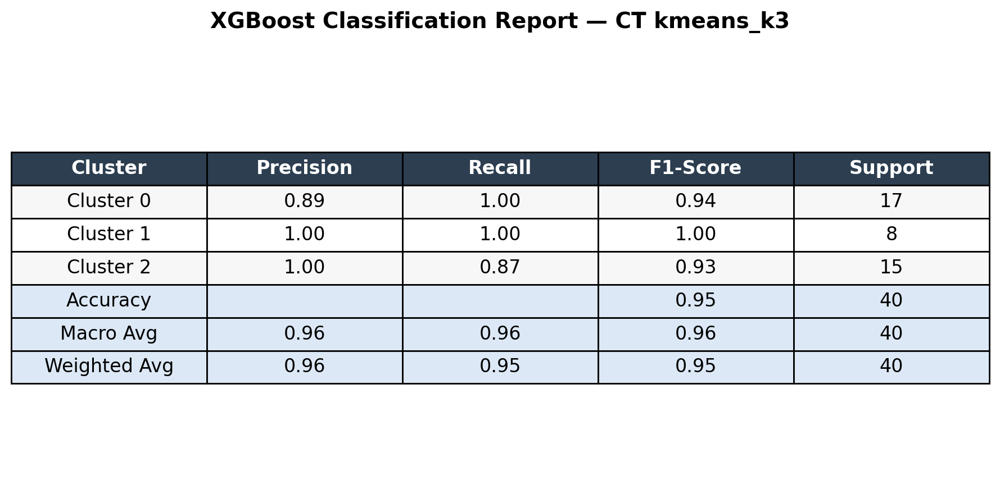
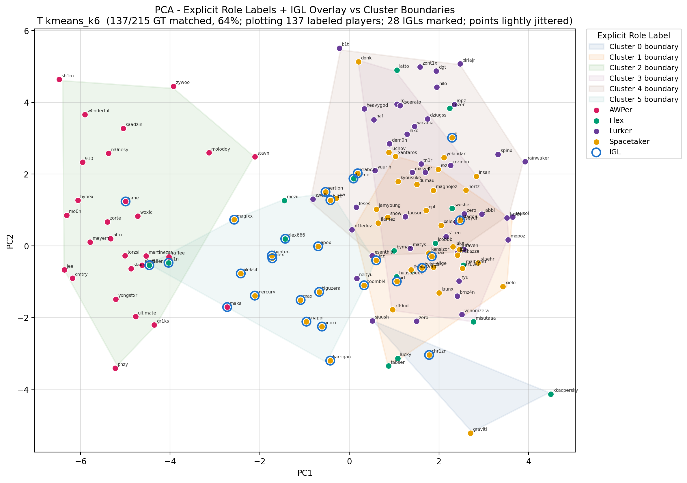
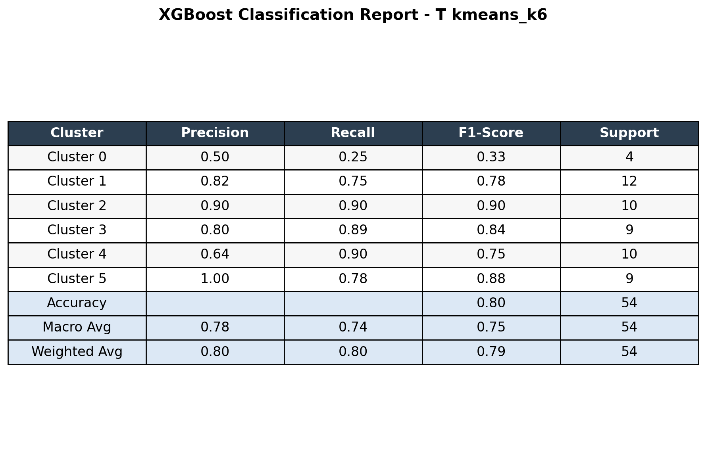
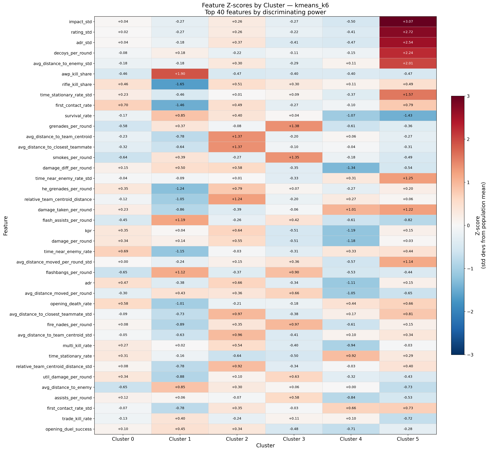

# Unsupervised Role Discovery from Professional Counter-Strike 2 Demo Data 
## Overview

This project builds an end-to-end unsupervised learning pipeline to discover professional Counter-Strike 2 player role archetypes from raw demo files. Using 468 professional demos and 215 players, the pipeline parses .dem replay data, engineers side-specific behavioral and positional features, and evaluates whether recognizable roles emerge naturally from gameplay behavior.

The project compares KMeans, Gaussian Mixture Models, and HDBSCAN using internal clustering metrics, bootstrap stability analysis, expert-curated role annotations, and model-based interpretability. The main finding is that AWPers are highly separable across both CT and T side, while rifler and IGL-related roles are more overlapping and context-dependent.

The full report can be read [here](report.pdf)

## Research Question

Can professional CS2 player roles be discovered from behavioral and positional gameplay statistics using unsupervised learning?

## Data and Pipeline

The dataset includes 468 professional demos from four S-tier events and covers 215 professional players. Each player is modeled separately on CT and T side because role behavior differs substantially between attacking and defending.

The pipeline extracts combat events, utility usage, opening duels, trade interactions, movement behavior, and player positioning. These raw events are transformed into normalized player-side features, with both averages and standard deviations to capture variability.

Feature groups include:

| Group         | Examples                                                                  |
| ------------- | ------------------------------------------------------------------------- |
| Combat        | ADR, kills per round, survival rate, rifle/AWP kill share                 |
| Opening duels | Opening kill rate, opening death rate, first contact rate                 |
| Trading       | Trade kill rate, death traded rate, trade participation                   |
| Utility       | Smokes, flashes, incendiaries, flash assists, utility damage              |
| Positioning   | Distance to enemies, distance to team centroid, nearest teammate distance |
| Movement      | Movement distance per round, stationary rate                              |

## Modeling and Evaluation

All numeric features are standardized before clustering. The project evaluates KMeans, Gaussian Mixture Models, and HDBSCAN, with PCA used for visualization.

Because there is no definitive label set for CS2 roles for all players, model quality is evaluated using multiple signals:

| Method                  | Purpose                                              |
| ----------------------- | ---------------------------------------------------- |
| Silhouette score        | Measures cluster separation                          |
| Davies-Bouldin index    | Measures cluster compactness                         |
| Bootstrap ARI stability | Tests whether clusters reappear under resampling     |
| Expert role annotations | Measures alignment with curated role labels          |
| XGBoost / Random Forest | Tests cluster reproducibility and feature importance |

External validation uses expert-curated role annotations from [NER0cs’s Positions Database](https://public.tableau.com/app/profile/harry.richards4213/viz/PositionsDatabaseNER0cs/PositionsDatabaseNER0cs), maintained by Harry “NER0cs” Richards, a Counter-Strike analyst and writer for HLTV.org. The database contains manually labeled roles for prominent professional players in top-tier Counter-Strike 2. These labels are treated as expert reference annotations rather than absolute ground truth.

<table>
  <tr>
    <td width="50%">
      
    </td>
    <td width="50%">
      
    </td>
  </tr>
</table>

## Key Results
#### CT Side

The best CT-side model is KMeans with k = 3.

| Cluster | Result                                      |
| -------------- | ------------------------------------------- |
| Rotators       | Cleanest non-AWPer CT rifler group          |
| Anchors        | Meaningful but noisier CT rifler group      |
| AWPers         | 100% purity against expert reference labels |

The CT model achieved 79.6% matched-sample purity, 0.616 ARI against expert reference labels, and 91% XGBoost held-out accuracy. The main CT-side finding is that AWPers are highly separable, while riflers split into a distinct but imperfect Rotator/Anchor structure.

    
    

#### T Side

The best T-side model is KMeans with k = 6.

| Cluster type       | Result                                         |
| ------------------ | ------------------------------------------------------ |
| AWPers             | Cleanest and most stable T-side cluster                |
| Lurkers            | Strongest non-AWPer T-side cluster                     |
| Spacetakers        | Split across multiple overlapping subgroups            |
| IGL-heavy subgroup | Utility-oriented cluster with strong IGL concentration |

The T-side model achieved 70.8% matched-sample purity, 0.314 ARI against expert reference labels, and 80% XGBoost held-out accuracy. AWPers were again the most separable role, while Lurkers formed the clearest non-AWPer group. Spacetakers were split across multiple clusters, with small variations between the clusters.

    
    

    

The model also identified an IGL-heavy subgroup characterized by stronger utility usage and teammate-proximity patterns. Because the model has no access to voice communication or strategy calls, this cluster should be interpreted as an indirect behavioral signal rather than proof that in-game leadership is directly observable from the derived statistics alone.

    

## Main Findings

- AWPers are the most separable role across both CT and T side.
- CT-side riflers split into a meaningful but imperfect Rotator/Anchor structure.
- T-side Lurkers are reasonably separable, while Spacetakers form several overlapping subgroups with different characteristics.
- The IGL-heavy T-side cluster suggests that some calling responsibilities may leave indirect signals through utility usage and teammate proximity.
- KMeans produced the most interpretable role structures. GMM was less stable, and HDBSCAN produced degenerate solutions with many outliers.

## Limitations

The final clustering dataset covers 215 players, which is small for unsupervised learning. The player pool is also restricted to top-tier professionals, creating a compressed skill distribution where role differences may be subtle and/or overlapping.

The external role annotations are expert reference labels, not absolute ground truth. CS2 roles vary by map, side, opponent, economy state, roster context, and team system. Some players also occupy multiple roles simultaneously, so disagreement between clusters and labels may reflect role overlap rather than model failure.

The current feature set averages behavior across maps. This improves player-level stability but removes tactical context, especially on CT side where anchoring, rotation, and site responsibility are highly map-dependent.

The model also has no access to voice communication, mid-round calls, set strategies, or intended tactical responsibilities. This is especially important for interpreting the IGL-heavy cluster, which should be treated as an indirect behavioral signal rather than direct proof of in-game leadership.

## Future Work

Future extensions include map-stratified clustering, feature ablation studies, null-label baselines, tournament-level stability checks, and an interactive player similarity dashboard.

The highest-priority next step is ablation analysis: removing weapon, positional, utility, and combat features to test which feature groups are driving the discovered clusters.

